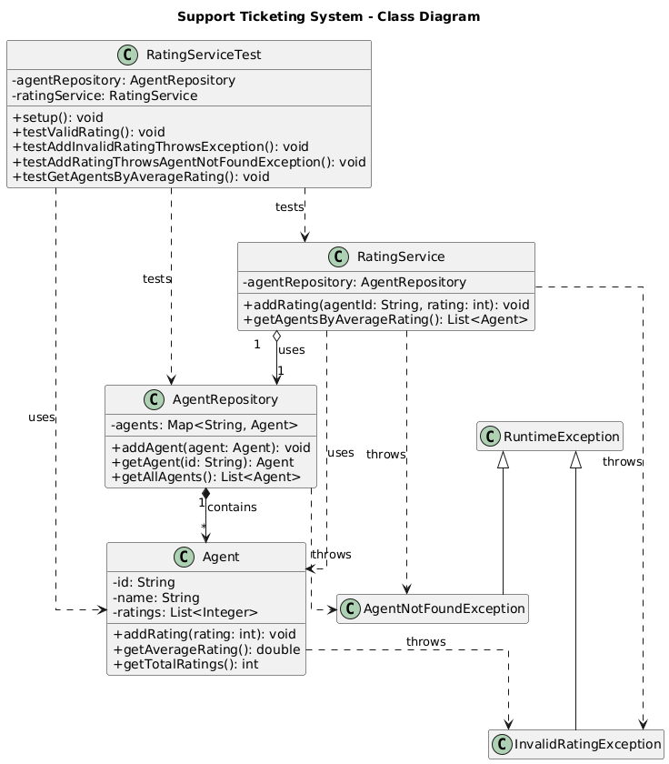

----------------------------------------------------------------------
Question:

why do we not have addRating method in AgentRepository?

we can also implement addRating with arguments rating and agentid and we can call the agent class' method to addRating from here. is that bad design?

Answer:

this is generally considered not the best design for a few key reasons related to the Single Responsibility Principle (SRP):

Repository's Responsibility: The primary job of a repository (AgentRepository) is to manage a collection of objects. Think of it like a database table interface. Its responsibilities should be limited to data access operations like creating, retrieving, updating, and deleting the entire Agent object (e.g., addAgent, getAgent, deleteAgent).

Agent's Responsibility: The Agent class is responsible for its own data and business rules. The logic for how a rating is added (including validation, like checking if it's between 1 and 5) belongs inside the Agent class. This is good encapsulation.

Service's Responsibility: A "service" class (like your RatingService) is the perfect place to orchestrate or coordinate actions between different components. The current design is a great example of this:

The RatingService's addRating method is asked to perform a business action.
It uses the AgentRepository to fetch the correct agent.
It then tells the Agent object to perform the action (agent.addRating(rating)).
Conclusion:

While your proposed design would work, it mixes the responsibilities of data access (the repository's job) with business logic orchestration. The current design, which uses a RatingService, provides a much cleaner separation of concerns, making the application easier to understand, test, and maintain.

----------------------------------------------------------------------

Question:

what if we omit agentrepository altogether and handle everything from the ratingservice?

Answer:

Why This Is Not a Good Design
This approach mixes two very different responsibilities into one class, which leads to several problems:

Violation of the Single Responsibility Principle (SRP):

The RatingService now has two reasons to change:
If the business logic for ratings changes (e.g., how agents are sorted).
If the data storage mechanism changes (e.g., you decide to move from an in-memory Map to a real database).
A class should ideally have only one reason to change.
Poor Separation of Concerns:

The current design has a clean separation: AgentRepository handles how data is stored, and RatingService handles what to do with that data (the business rules).
Merging them creates a single, more complex class that is harder to understand and maintain.
Reduced Testability:

With a separate AgentRepository, you can easily test your RatingService by "mocking" the repository. This means you can test your business logic in isolation without worrying about the data storage.
If they are merged, you can't easily separate the business logic from the data storage for testing, making your tests more complicated and brittle.
Lack of Reusability and Scalability:

What if another part of your application needs to access the list of agents, but doesn't care about ratings? For example, an OnboardingService. It would be forced to depend on RatingService, which is incorrect.
A separate AgentRepository can be reused by any service that needs access to agent data.
Conclusion
While you can put everything into the RatingService, separating the data access logic into a dedicated AgentRepository creates a more modular, testable, and maintainable application. This layered architecture is a fundamental concept in building robust software.

----------------------------------------------------------------------

Question:

can agents be static here?

Answer:

Why This Is Usually Not a Good Idea
Global State: Making the agents map static effectively turns it into a global variable. Global state can make your application harder to reason about, debug, and maintain, as any part of the code could potentially modify it.

Poor Testability: This is a major drawback. When you write unit tests, you typically want each test to run in isolation.

If the agents map is static, it will retain its state between tests. One test adding an agent could affect the outcome of another test that expects the repository to be empty.
With an instance field (non-static), you can simply create a new AgentRepository() for each test, ensuring you always start with a clean, predictable state.
Inflexible Design: The decision of whether the repository should be a single, shared instance (a "singleton") should be made by the code that uses the repository, not by the repository itself.

In a Spring application, you would typically define AgentRepository as a singleton bean. Spring ensures only one instance is created. The agents map can remain a regular instance field. This is a much cleaner and more standard approach.
Conclusion
While making agents static might seem to work, especially if you only ever intend to have one repository, it leads to a rigid and hard-to-test design.

Best Practice: Keep agents as a private final instance field. Let the framework (like Spring) or your application's entry point manage the lifecycle of the AgentRepository object itself (e.g., by creating it as a singleton).

=================================================================

Other optimizations:

Follow-up 1: The getRatings() call is becoming slow. How do you optimize it? (My solution involved pre-calculating and caching the sorted list, updating it only when new ratings come in).

ChatGPT said:
Great follow-up — you're thinking in the right direction. Pre-computing and caching the sorted list of agents by their average ratings is a solid optimization, especially when getRatings() is called frequently but ratings change infrequently.

✅ Problem:
getRatings() is slow because:

It calculates average ratings for every agent on every call.

It sorts all agents on each call — O(n log n) where n = number of agents.

✅ Optimization Strategy: Cache + Invalidation
Cache the sorted list (agents by average rating).

Update the cache only when new ratings are added or removed.

Use a dirty flag or recalculate only for affected agent(s).

✅ Changes to Implement:
1. Add a cache inside RatingService:
java
Copy
Edit
private List<Agent> cachedSortedAgents = new ArrayList<>();
private boolean cacheDirty = true;
2. In addRating(...), mark the cache as dirty:
java
Copy
Edit
public void addRating(String agentId, int rating) {
    Agent agent = agentRepository.getAgent(agentId);
    if (agent == null) {
        throw new AgentNotFoundException("Agent not found: " + agentId);
    }

    agent.addRating(rating); // This internally updates average etc.

    cacheDirty = true; // Mark cache as dirty
}
3. In getAgentsByAverageRating(), use the cache:
java
Copy
Edit
public List<Agent> getAgentsByAverageRating() {
    if (cacheDirty) {
        cachedSortedAgents = agentRepository.getAllAgents()
            .stream()
            .sorted(Comparator.comparingDouble(Agent::getAverageRating).reversed())
            .collect(Collectors.toList());

        cacheDirty = false;
    }
    return cachedSortedAgents;
}

